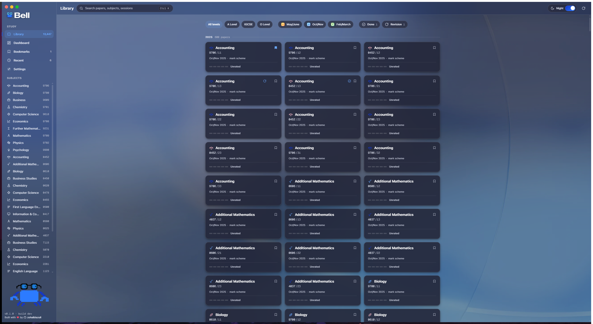
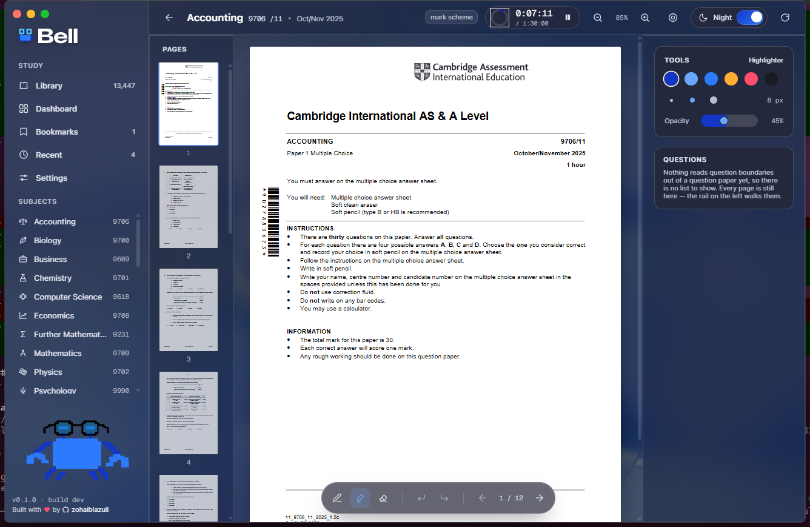
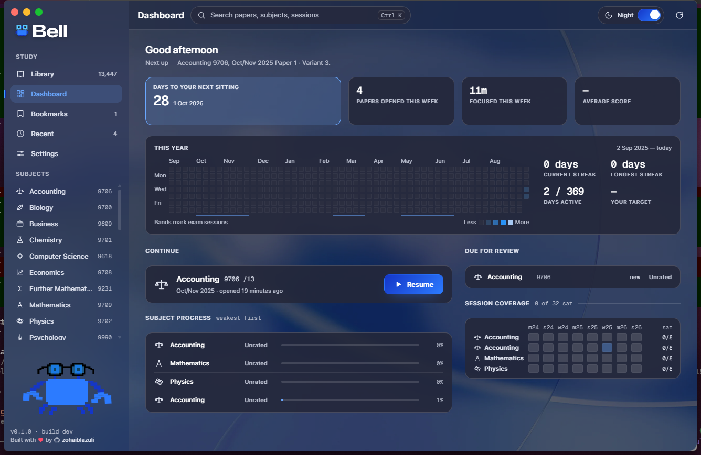
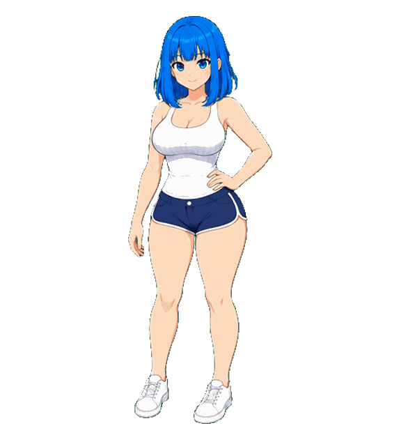

<div align="center">


# Bell

**A calm, offline-first desktop app for studying Cambridge past papers.**

Browse the entire CAIE catalogue, pull the papers you want onto your own machine, then annotate, time yourself, and track your focus — all with the network unplugged.

<br />


<br />


</div>

<br />

<div align="center">
  
</div>

<br />

## What it is

<table><tr><td valign="top" width="72%">

Bell is a downloadable Windows desktop app for focused studying of Cambridge (CAIE) exam papers. It downloads the papers you ask for onto your own machine and then gets out of the way so you can work.

Everything that matters happens locally. Browsing, searching, reading, annotating, timing, and drawing all keep working with the network unplugged — off the cached catalogue and the files already on disk.

</td><td valign="top" align="center" width="28%">

</td></tr></table>

## Features

<table><tr><td valign="top" width="72%">

- **The whole CAIE catalogue, searchable.** A Level, IGCSE, and O Level — every subject, session, and variant. Filter by level, exam series, or your own done / revision flags, and jump anywhere with `⌘K`.
- **Papers you actually own.** Bell fetches PDFs onto your machine into a clean, human-browsable folder tree. Once a paper is down, it opens with the network off.
- **A real reader.** Papers render in-app with a page rail, zoom, and the mark scheme one click away — side by side with the question paper.
- **Annotate like paper.** A six-colour highlighter and pen with adjustable width and opacity, drawn on a canvas overlay. Ink is stored as fractions of the page, so it stays put through any zoom, resize, or move to another display.
- **Time yourself.** A focus stopwatch lives in the top bar and feeds your weekly focus minutes.
- **Track the year.** A contribution-style activity grid, per-subject progress, session coverage, and a "due for review" queue on the dashboard.
- **Day and Night.** A product-level tone toggle — not a system setting — with a design system tuned so the bright white PDF is always the clearest thing on screen.

</td><td valign="top" align="center" width="28%">

</td></tr></table>

## A look around

<table><tr><td valign="top" width="72%">

<div align="center">

**Library — Day & Night**


**Reader with live annotation and the focus timer**



**Dashboard — the year at a glance**



</div>

</td><td valign="top" align="center" width="28%">

</td></tr></table>

## Built with

| Layer | Stack |
| --- | --- |
| Shell | [Tauri v2](https://tauri.app) — small native Windows binary |
| Frontend | React 19 · TypeScript · Vite · Tailwind v4 |
| PDF | `pdfjs-dist` in the webview + a `<canvas>` annotation overlay |
| Core | Rust — catalogue sync, downloads, and local storage |
| Cache | SQLite for the catalogue snapshot; one JSON file per key for study state |

The frontend never touches the network directly. All HTTP lives in Rust, which keeps the webview as network-isolated as it was when the app had no network at all.

## Getting started

<div align="center">
  
</div>

> **Prerequisites:** [Node.js](https://nodejs.org) (with npm) and the [Rust toolchain](https://www.rust-lang.org/tools/install), plus the [Tauri v2 system dependencies](https://v2.tauri.app/start/prerequisites/) for your platform.

```bash
# install frontend dependencies
npm install

# run the app in development (hot-reload frontend, Rust recompiles on change)
npm run tauri dev

# build the Windows installer
npm run tauri build
```

### Other useful scripts

```bash
npm run build          # frontend typecheck + bundle only
npm test               # unit tests (Node's own test runner)
npm run tokens         # regenerate design tokens from the Figma-measured table
npm run verify:papers  # end-to-end check of the catalogue API and download redirect
```

## How it fits together

Bell caches a catalogue it does not own and downloads the files you ask for. Two public, unauthenticated endpoints do all the talking:

```
GET /api/desktop/v1/catalog                  the whole catalogue (~70 KB gzipped, ETag + 304)
GET /api/desktop/v1/file/{paperId}/{qp|ms}   redirects to the real PDF, resolved server-side
```

Downloads land under `Documents\Bell` in a browsable tree:

```
A Level\Mathematics (9709)\Feb-Mar (m16)\9709_m16_qp_62.pdf
```

A catalogue resync only ever replaces the catalogue tables — the record of what you've downloaded is never touched.

## Design

Bell's interface is authored as a measured design system in the spirit of the OS-glass lineage (Aqua → visionOS → Liquid Glass), used as a material and an accent rather than wallpaper. Glass is chrome, never content; a single blue accent is spent as a line, not a wash; and difficulty carries its own separate warm heat scale. The hero of every screen is the bright white exam PDF.

## License

Bell is **source-available, not open-source**. The code is public to read and learn from, but it is not licensed for redistribution or commercial use — in part because it vendors third-party assets (the SF Pro typeface and Cambridge marks) that are not ours to relicense. See [LICENSE](LICENSE) for the full terms.

## Acknowledgements

- Cambridge, CAIE, and the Cambridge Assessment International Education name and logo belong to Cambridge University Press & Assessment. Bell is an independent study tool and is not affiliated with or endorsed by Cambridge.

---

<div align="center">
  
  &nbsp;&nbsp;&nbsp;
  
  <br /><br />
  <sub>Built with ♥ by <a href="https://github.com/zohaiblazuli">zohaiblazuli</a></sub>
</div>
